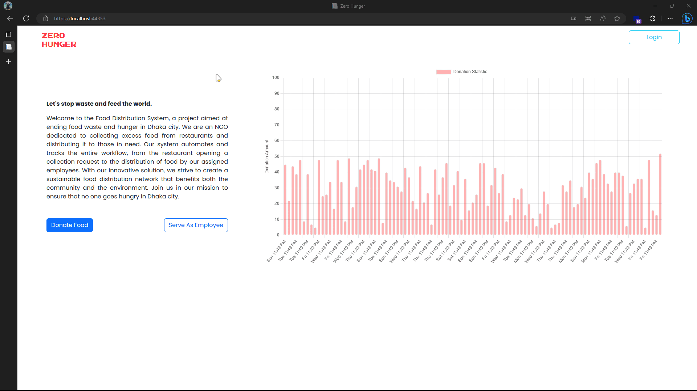
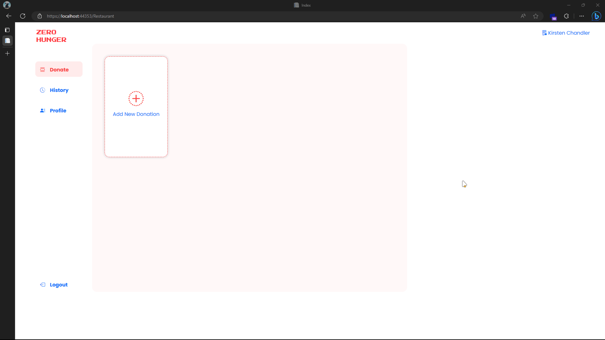
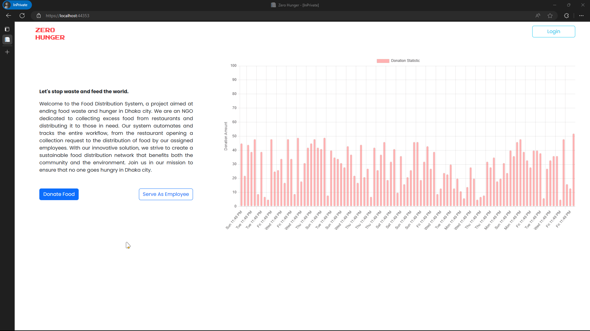
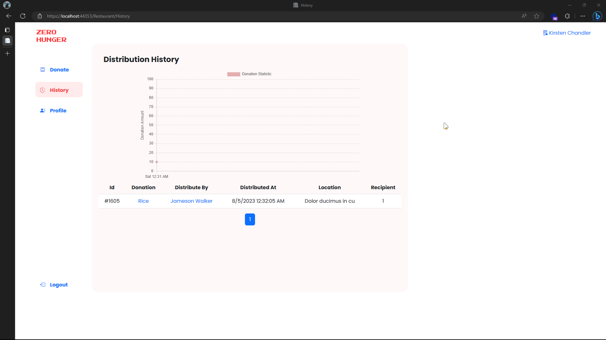

# Food Distribution System

The Food Distribution System is a project designed to help an NGO collect excess food from restaurants and distribute it to deprived people and children in Dhaka city. The system automates and tracks the entire workflow, from the restaurant opening a collect request to the distribution of food by the assigned employee.

## Features

- Restaurant and employee accounts with authentication and authorization
- Dashboard for restaurants to open collect requests
- Dashboard for employees to view requests, collect them and mark them as completed after distribution
- Tracking and reporting of food distributions
- Database to store and manage all data in the system

## Demo

Restaurant log

Donation request and distribution

Employee log

Edit profile and Donation

## Technologies

- .NET Framework 4.8.1
- Entity Framework 6.4.4 (Code First)
- Microsoft SQL Server
- ASP.NET MVC (for web application)

## Getting Started

1. Install .NET Framework 4.8.1 SDK and runtime from [Microsoft's official website](https://dotnet.microsoft.com/download/dotnet-framework/net48).
2. Clone this repository to your local machine.
3. Open the solution file (`FoodDistributionSystem.sln`) in Visual Studio.
4. Ensure that the Entity Framework package is installed. If not, install it via the NuGet Package Manager.
5. Set up a Microsoft SQL Server instance and update the connection string in the `Web.config` file.
6. Run the `Update-Database` command in the Package Manager Console to create the database schema using Entity Framework Code First migrations.
7. Run the project in Visual Studio, and the web application will be hosted on your local machine.

## Usage

1. Register accounts for restaurants and employees.
2. Log in as a restaurant and open a collect request.
3. Log in as an employee and view assigned requests. Mark them as completed after distributing the food.

## Schema

